# Sesión 1
En esta sesión revisaremos características  y particularidades de Python así como estructuras de datos en python y librerías utilizadas frecuentemente.

## Setup de python
### Lenguaje de programación
Python es un lenguaje OpenSource, lo que implica que no tiene costo y se desarrollan librerías que se pueden comapartir con la comunidad de Python sin ningún costo.  
Es un lenguaje utilizado en distintos ámbitos gracias a las distintas librerías generadas por la característica de OpenSource. Algunos de estos ámbitos pueden ser desarrollo web, análisis de datos, inteligencia artificial, automatizar tareas y demás.  

### Instalaciones de Python
Existen diversas formas de instalar el lenguaje Python en la computadora. Al instalar Python, se puede empezar a trabajar con el lenguaje pero existen IDEs para facilitar la escritura de código.
#### Distribución Python 
Una primera instalación se puede hacer desde la distribución "original" de [Python](https://www.python.org/). Esta distribución instalará el lenguaje en la computadora, es como si le diéramos a la computadora la capacidad de entender python.  Asimismo, se instala un conjunto de librerías base y un controlador de librerías llamado pip que se estará utilizando para poder hacer instalaciones de paquetes.  
Instalar librerías con pip facilita el manejo de versiones de estas ya que pip buscará una versión de la librería a instalar que vaya de acuerdo a las demás librerías instaladas en el mismo espacio eliminando posibles problemas de *dependencias* entre librerías.  
Haciendo la similitud con R y Rstudio, teniendo esta instalación ya es posible usar Python desde una terminal pero siempre va a ser más sencillo utilizar alguna IDE para trabajar. El más usado es VisualStudioCode y platicaremos más a fondo de esto en la sección de IDEs
#### Distribución Anaconda Navigator
Una segunda instalación de Python puede ser a través de [Anaconda](https://www.anaconda.com/download). Al hacer la instalación de python desde esta distribución, se instalará, además del lenguaje python, su propio controlador de librerías llamado _conda_, y un _Anaconda Navigator_ con más herramientas útiles a la hora de desarrollar como _Jupyter Notebook_, _Anaconda Prompt_, _Spyder_, y muchas otras más.


Dentro de estas herramientas, la más utilizada es Jupyter Notebook que es un tipo de documento en el que puedes combinar código y texto por lo que se vuelve una herramienta muy útil para generar reportes automatizados.  La terminación de este tipo de archivos es _.ipynb_  

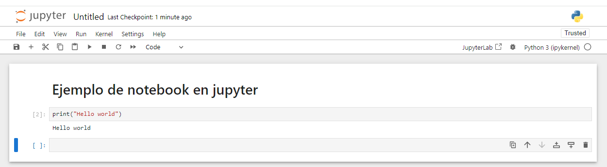
Instalar desde Anaconda Navigator es un gran camino cuando no queremos meternos en complicaciones de ubicaciones de python y si queremos también tener programas con los cuales interactuar con Python; la desventaja de esta distribución es que puede ser muy pesada y ocupar mucho espacio de memoria en la computadora.  
Si bien Jupyter Notebook es una gran herramienta por lo versátil de ir corriendo código y visualizando los resultados, no es la única forma en la que se puede correr el lenguaje python. La otra forma más estructurada de hacerlo es a través de un script de python (con terminación de archivo _.py_) y corriendo el script a través de una terminal que entienda el lenguaje python. La desventaja de este método es que se corre todo el script cada vez que ponemos el comando en la terminal y no sólo una celda con un cacho específico de código como en Jupyter Notebook.  

  


### IDEs
Dentro de los programas instalados en la distribución de Anaconda, está Spyder que es un IDE parecido a Rstudio (una consola del lenguaje, un espacio para hacer scripts de python (_.py_) y una pantalla de output de lo que se va ejecutando).  
Otro IDE muy utilizado es [VisualStudioCode](https://code.visualstudio.com/) que es más bien un editor de texto en esteroides (si, como un bloc de notas acelerado) y esta herramienta es muy útil para trabajar con código.  
La principal ventaja de VisualStudioCode es que al ser un editor de texto, puedes utilizarlo para distintos lenguajes (no solo Python) además de que tiene extensiones para facilitar algunas tareas como debuggear, visualizaciones, temas,....  
También, VSC (VisualStudioCode) tiene un manejador de archivos y carpetas entonces si es necesario trabajar con estructuras un poco más complejas de código, podemos manejar todo muy fácilmente desde VisualStudio.  
Dentro de las extensiones también podemos instalar git (controlador de versiones) y manejar las versiones de código con git desde VisualStudioCode!  
Cada día hay nuevas extensiones que pueden ayudar a que la experiencia con código sea lo más fácil.  

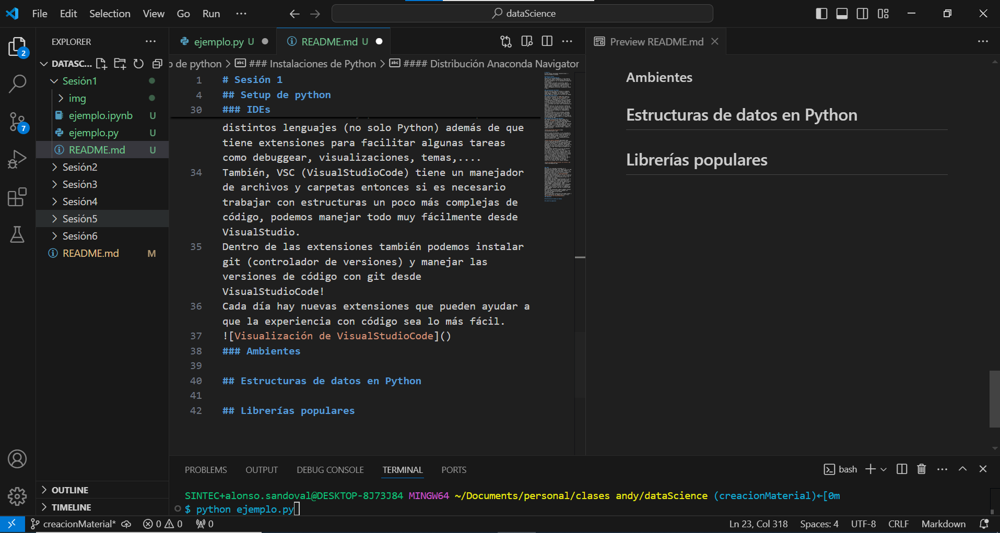  

### Ambientes

Una de las formas más limpias para trabajar con Python es a través de ambientes.
Pensemos en un ambiente como un entorno de desarrollo cerrado el cual podemos configurar especificamente para el proyecto que estamos trabajando; si necesitamos trabajar en otro proyecto al mismo tiempo, lo más recomendable es generar un ambiente distinto para ese otro proyecto.  
¿Por qué conviene esta forma de trabajo? Principalmente será para evitar problemas con versiones de las librerías y sus dependencias y también como un buena práctica para compartir nuestro trabajo.  
Pongamos el siguiente ejemplo: Imagina que has trabajado modelos de optimización para un proyecto, análisis de sentimientos en otro, algún modelo de machine learning para otro más. Cada proyecto necesita librerías distintas para poder funcionar adecuadamente y si el desarrollo se hubiera hecho sin dividir por ambientes entonces tendríamos una instalación de python con todos los paquetes necesarios para todos los proyectos.  
Si ahora tuvieras que compartir el código para el proyecto de análisis de sentimientos y te comparto un archivo con las librerías necesarias, no tendríamos forma fácil de identificar solamente las librerías que corresponden a este proyecto (recuerda que al instalar un paquete, se instalan otros más dependiendo de este; a estas librerías se les llama dependencias).  
Para que esto sea más sencillo, existen los ambientes en python y es realmente fácil de configurarlos.

#### Creación de ambientes con conda
Podemos crear ambientes desde alguna terminal de python (con la instalación de la distribución de anaconda se instala el programa _Anaconda Prompt_ y desde ahí podemos hacerlo) de la siguiente forma:

1. Abrimos la terminal buscando anaconda prompt en el buscador
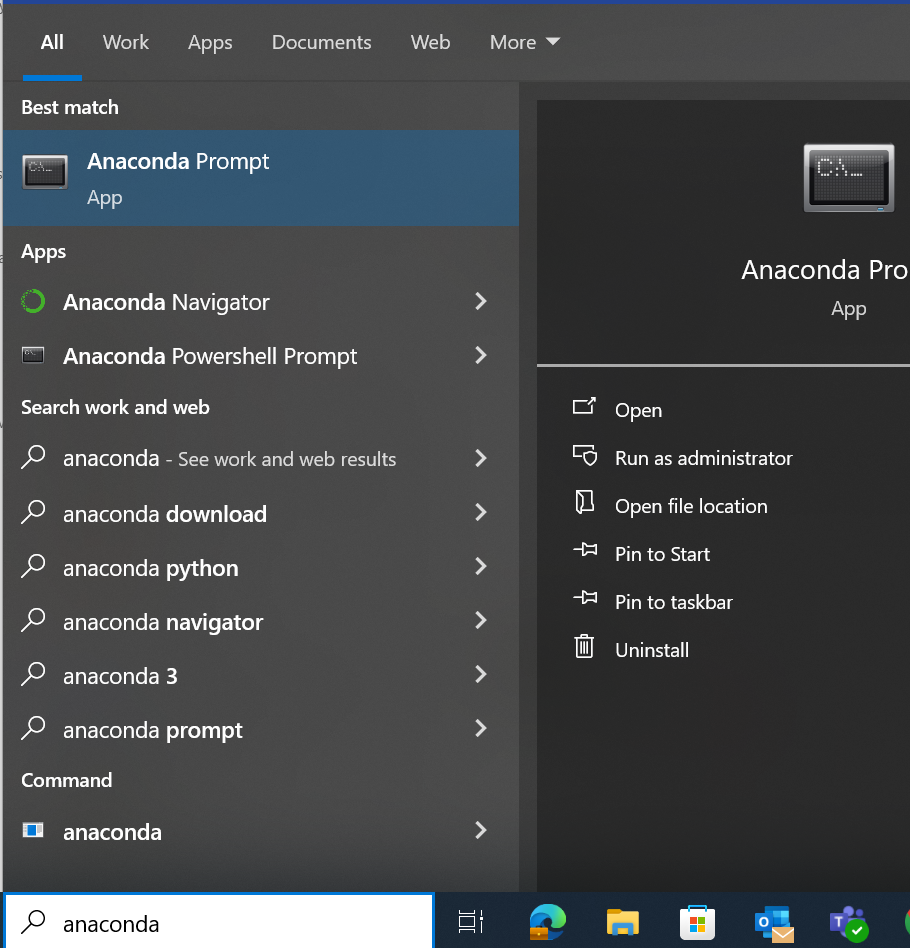

La terminal muestra el ambiente actual en el que se encuentra la terminal, en este caso está en el entorno base que es el ambiente general de la distribución de python.
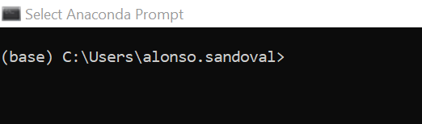

2. Creamos un ambiente llamado clases con el siguiente comando:
```
conda create --name clases python=3.12.0
```

El parámetro de python es opcional y es para especificar la versión de python a utilizar, por default utilizará la versión del base.
Cuando sea solicitado presionar la tecla _y_ para proseguir con la instalación:
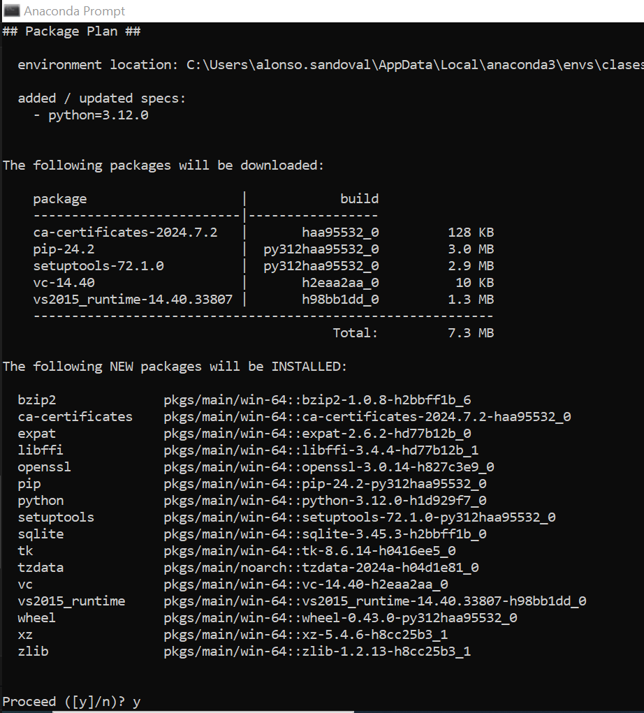

Una vez terminado el proceso, la terminal volverá a mostrar el prompt para poner una siguiente instrucción. En los mensajes del proceso vienen las instrucciones para activar y desactivar el ambiente:

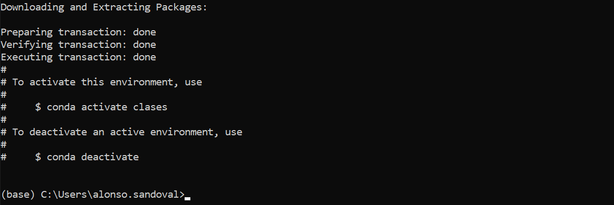

3. Activar el ambiente con el siguiente comando:

```
conda activate clases
```

El prompt en la terminal ahora muestra que estamos dentro del ambiente:

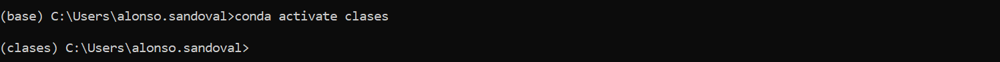

Ya estando dentro del ambiente, podemos hacer la instalación de paquetes necesarios para nuestro proyecto.

Cuando queramos correr los scripts de python que correspondan a este proyecto y a estas librerías, tenemos que asegurarnos de tener nuestro ambiente activo o seleccionado. En el csao de estar trabajando en un notebook, el famoso kernel va a hacer referencia al ambiente en el que queremos trabajar.

En la sección de _Manejo de terminal veremos cómo podemos correr y asegurarnos de estar en el ambiente adecuado_

4. Finalmente, si queremos desactivar el ambiente ya sea porque finalizamos la sesión de trabajo o queremos movernos de ambiente, podemos desactivarlo con el siguiente comando:

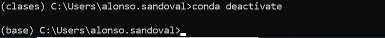
Observamos que el prompt pasa de mostrar que estamos dentro del ambiente clases, al ambiente base.

###  Instalación de librerías
Dentro de cualquier distribución de python que se instale, viene un manejador de paqueterías que se llama _pip_ y con este podemos instalar librerías.
La ventaja de usar estos manejadores es que también instalan las dependencias de otras librerías con las versiones que sean necesarias (puede desintalar una versión para instalar otra reciente si así lo necesitara) y de ahí que sea importante mantener separados los espacios de trabajo con los ambientes.  
Dentro de la distribución de anaconda viene otro manejador de paqueterías _conda_ que va a buscar en las paqueterías de anaconda para hacer la instalación.  
Si tienes una instalación de anaconda puedes utilizar tanto _pip_ como _conda_ como comandos para instalar paquetes.
#### Ejemplo de instalación de paquetes
Vamos a hacer un ejemplo instalando una paquetería en el entorno que ya creamos _clases_.  
1. Abrir una terminal con entorno python (por ejemplo, Anaconda Prompt)
2. Activar el ambiente con el siguiente comando:
```
conda activate clases
```
Verificamos que el prompt muestre el ambiente activado  


3. Instalación de la paquetería _pandas_ utilizando _pip_ con el siguiente comando:
```
pip install pandas=2.2.2
```
La parte del comando donde se especifica la versión es opcional, también se puede instalar solo con _pip install pandas_

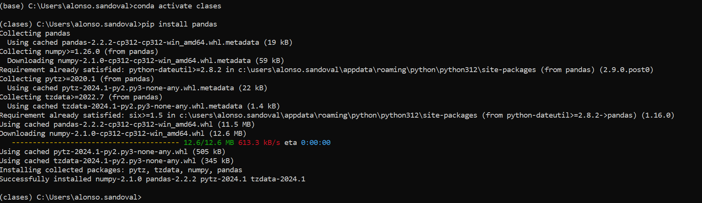
Podemos observar que al hacer la instalación de _pandas_ también instaló _pytz, tzdata_ y _numpy_ y verificamos la instalación exitosa con el mensaje en la terminal y que ha terminado porque nos vuelve a poner el prompt para teclear algún comando.

Podemos enlistar las librerías instaladas con el siguiente comando:
```
pip freeze
```

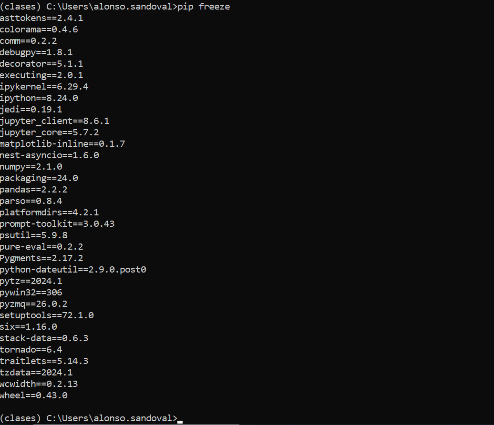
Aunque sólo hicimos la instalación de una librería, ya tenemos muchas más instaladas por la creación del ambiente y por dependencias con la librería instalada.

### Manejo de terminal
Utilizar la terminal representa otro conjunto de skills más a desarrollar que no abordaremos pero si es importante saber cómo utilizar comandos básicos para que nos sea más sencillo el manejo de las librerías y repositorios en python.  
La terminal está formada por varios elementos:
* Si estás dentro de una terminal con ambiente de python te muestra el ambiente en el que te encuentras, por default muestra el ambiente base

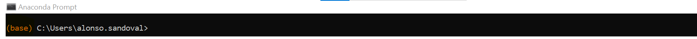

* Como 2o elemento muestra el directorio de trabajo en el que te encuentras en la terminal, tal cual es una ubicación de una carpeta en tu computadora

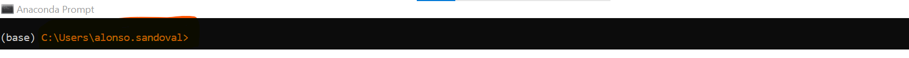

* Mientras veamos el cursor activo, la terminal está lista para _escuchar_ comandos

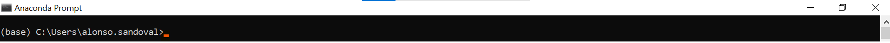

#### Algunos comandos útiles
##### cd
Para entrar en carpetas podemos utilizar el comando _cd_ y de esta forma podemos navegar hasta la ubicación de nuestro proyecto en la terminal:
```
cd Documents/personal/
```
Con este comando estamos moviendo la terminal a que apunte al directorio personal dentro del directorio Documents y el prompt ahora nos muestra esta nueva ubicación:

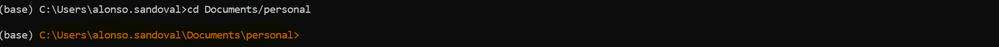

Si queremos regresarnos algún nivel de directorio podemos utilizar el comando _cd_ seguido de _.._ de esta forma:
```
cd ..
```
##### dir
El comando dir nos sirve para enlistar todos los elementos del directorio en el que estamos ubicados en la terminal, muestra tanto archivos como subdirectorios:
```
dir
```

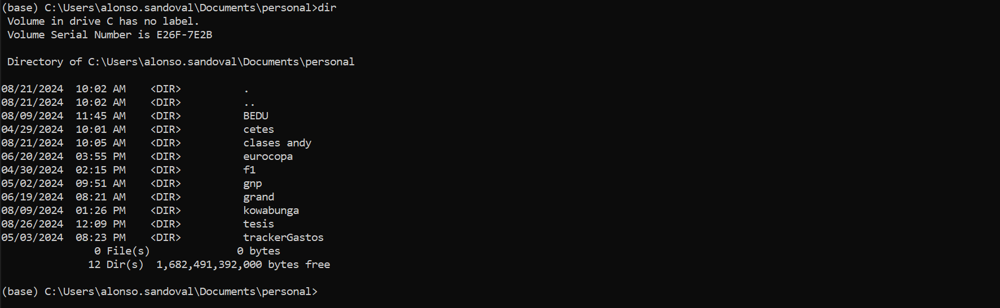

#### Terminal en Visual Studio Code

Una de las ventajas del uso de VisualStudio Code es que tenemos tanto una vista de las carpetas, un espacio para generar código, oportunidad para trabajar con notebooks de python y una terminal todo en una sola vista, de ahí que es de los editores más utilizados.

Otro elemento que podemos visualizar en la terminal, si es que estamos ubicados en un directorio que corresponde a un repositorio de git (controlador de versiones que utiliza Github) es la rama de trabajo de la versión.
Aquí se muestra la vista de la terminal desde VSC (también observamos que dependiendo el tema de VSC también te hace distinciones entre los distintos elementos de la terminal)

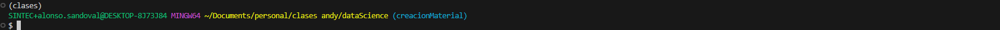

En este ejemplo, la terminal está ubicada dentro de la carpeta dataScience que corresponde a un repositorio con git entonces en azul muestra la rama en la que se está trabajando que en este caso es la rama creacionMaterial.  

Existen muchos otros comandos en terminal ya que desde aquí podemos manejar toda una computadora!  
Imagínate el siguiente escenario; contratas un servicio en la nube para tener una computadora super potente pero esa computadora no tiene un sistema operativo con interfaz tal cual cómo estamos acostumbrados, solamente tiene una terminal con la cual puedes interactuar!  
Por lo tanto, te imaginarás que el manejo de terminal es muy poderoso.  

## Estructuras de datos en Python
En esta sección revisaremos estructuras principales de datos en Python con la ayuda de cuadernos de trabajo. Recuerda asegurarte de estar trabajando en el ambiente que generamos para la clase desde el kernel en el notebook.

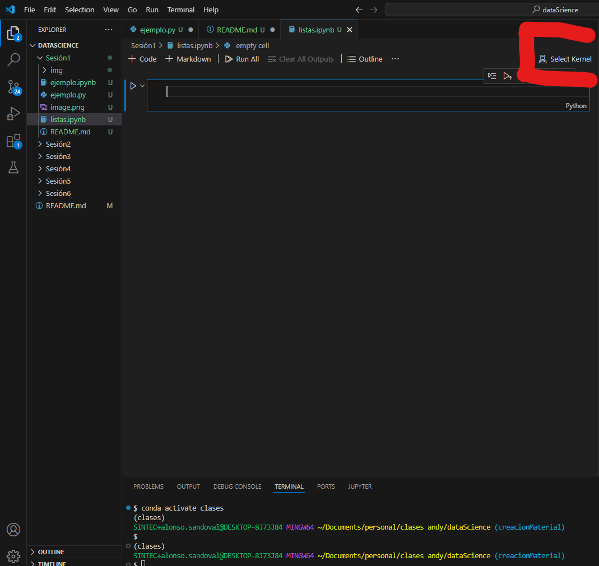

Una vez seleccionado, muestra el ambiente en el que estamos trabajando

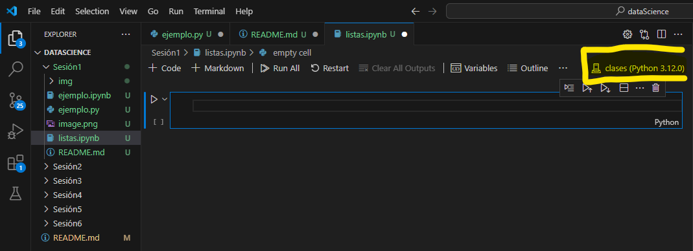

### Listas
Notebook de ejemplo utilizando listas: [Ejemplo con listas](Notebooks/listas.ipynb)
#### Reto
Resuelve el siguiente reto de manejo de listas:

Utilizando una cadena de caracteres con tu nombre, guarda en una lista las letras únicas en tu nombre y muestra un conteo de cuántas veces aparece cada letra.  
Tip1: utiliza el método lower() del objeto str para transformar la cadena de caracteres con tu nombre a minúsculas  
Tip2: el comando set convierte una lista en un conjunto (objeto matemático conjunto) por lo que no existirán valores duplicados.  
Tip3: utiliza un for para iterar sobre las letras y ve imprimiendo el conteo.  

La solución se encuentra aquí: [Solución reto listas](Retos/lista.ipynb)

### Diccionarios
Notebook de ejemplo utilizando diccionarios: [Ejemplo con diccionarios](Notebooks/diccionario.ipynb)

#### Reto
Utilizando una cadena de caracteres con tu nombre, genera un diccionario donde las llaves sean las letras únicas en tu nombre y los valores sean el número de veces que aparece dicha letra en tu nombre  
Tip: combina los tips del reto de listas con lo que aprendimos de los diccionarios para generar la respuesta.

La solución del reto se encuentra aquí: [Solución reto diccionarios](Retos/diccionario.ipynb)

### Iterables
Notebook de ejemplo utilizando iterables: [Ejemplo con iterables](Notebooks/iterables.ipynb)

#### Reto

Utilizando lo aprendido con los iterables modifica el reto del ejercicio de diccionarios para que sea más sencillo.
La solución del reto se encuentra aquí: [Solución reto iterables](Retos/iterable.ipynb)

### List comprehension
Notebook de ejemplo utilizando list comprehension: [Ejemplo con list comprehension](list_comprehension.ipynb)

#### Reto
Modifica el algoritmo del reto anterior para simplificar el código utilizando dict comprehension.  
La solución del reto se encuentra aquí: [Solución reto comprehension](Retos/comprehension.ipynb)

### Programación orientada a objetos
Python es un lenguaje de Programación Orientada a Objetos, lo que quiere decir es que cada elemento que definas dentro de python pertenece a alguna clase. Estas clases pueden ser clases nativas (str, num, list, dict), objetos generados por alguna librería u objetos generados por clases propias.  
En programación Orientada a Objetos vamos a tener principalmente 2 elementos: _atributos_ y _métodos_. Los atributos son todas aquellas definiciones inherentes a la clase, en otras palabras, son elementos que cada objeto de nuestra clase va a tener. Los métodos son funciones dentro de la clase que normalmente utilizará los atributos definidos.  

La sintáxis con python para los objetos hace que puedas programar una clase en un script de python (archivo con terminación _.py_) y utilizar esta clase en algún otro documento de python. También se puede hacer un script en el que estén definidias todas las funciones a utilizar y utilizarlas en un script _main_ que las utilice para la estructura general del algoritmo.  

Vamos a ver ejemplos de esto en los siguientes scripts generando una clase humano en un script llamado humano.py donde tengamos los atributos nombre, apellido_paterno, apellido_materno, año_nacimiento, mes_nacimiento, dia_nacimiento y el método calculaEdad que calculará la edad en años,meses y días. 
Ya con la clase definida, la utilizaremos en el script clases.ipynb para definir y calcular nuestras edades.  

Script creando una clase: [Ejemplo de creación de clase](Scripts/humano.py)  
Notebook utilizando un objeto de una clase: [Ejemplo utilizando clases](Scripts/clases.ipynb)

#### Reto
Agrega la función de las letras del reto de dict comprehension como un método dentro de la clase humano y comprueba y utiliza las funciones con tu nombre.  
La clase con el nuevo método está aquí: [Clase humano con nuevo método](Retos/humano.py)
El notebook donde está el ejemplo de uso está aquí: [Reto de clases](Retos/clase.ipynb)


## Librerías populares

Existen muchas librerías dentro de python que se pueden utilizar para resolver distintos problemas aquí utilizaremos algunas librerías usadas constantemente.  
Recuerda que se pueden instalar las librerías desde una terminal (asegurándonos de estar en el ambiente adecuado del proyecto) con el comando "pip install" y el nombre de la librería o con "conda install" y el nombre de la librería.  
También es posible hacer instalaciones desde una celda de python en un notebook con el mismo comando y agregando un "!" al principio de esta forma:

```
!pip install numpy
```

Trabajaremos con distintas librerías en el siguiente script: [Uso de librerías](Notebooks/librerias.ipynb)

Eso es todo para la sesión 1!