# Sesión 2

## 1. Función de distribución de probabilidad

### ¿Qué es una función de distribución?
Una función de distribución de probabilidad es una herramienta fundamental en la estadística que describe cómo se distribuyen las probabilidades de una variable aleatoria. Esta función proporciona la probabilidad de que la variable aleatoria asuma ciertos valores. En términos matemáticos, para una variable aleatoria $X$, la función de distribución se denota generalmente como  $P(X \leq x)$, donde $x$ es un valor específico.  

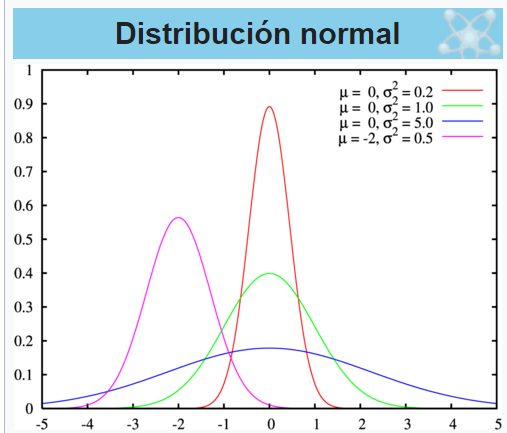

También existen las funciones de probabilidad acumulada que deben cumplir los siguientes elementos para F:
1. $0 \leq F(x) \leq 1$
2. límite cuando x tiende a infinito de $F(x)$ es igual a 1 (en el infinito acumulas toda la probabilidad del evento)
3. límite cuando x tiende a menos infinito de $F(x)$ es igual a 0 ( en el -infinito no tienes probabilidad acumulada)
4. Es monótona no decreciente, es decir, si $x \leq y$, entonces $F(x)$ $\leq$ $F(y)$
5. Es continua por la derecha

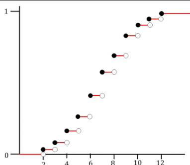

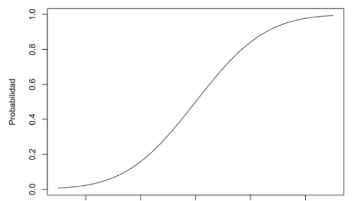

### Tipos de funciones de distribución
- **Funciones de distribución discretas:** Estas son aplicables a variables aleatorias que pueden tomar un número finito o contable de valores. Cada uno de estos valores tiene una probabilidad asociada. Ejemplos incluyen:
  - **Distribución Binomial:** Modela el número de éxitos en $n$ ensayos independientes (p.ej., lanzar una moneda varias veces).

  - **Distribución de Poisson:** Modela el número de eventos que ocurren en un intervalo de tiempo fijo o en un área determinada (p.ej., el número de llamadas a un centro de servicio por hora).

- **Funciones de distribución continuas:** Estas son aplicables cuando la variable aleatoria puede tomar cualquier valor dentro de un intervalo continuo. En este caso, hablamos de la densidad de probabilidad, que se integra a lo largo de un intervalo para obtener probabilidades. Ejemplos incluyen:
  - **Distribución Normal:** Caracterizada por su forma de campana, describe fenómenos naturales como la altura humana.

  - **Distribución Exponencial:** Modela el tiempo entre eventos en un proceso de Poisson.

### Principales funciones de distribución
- **Distribución Normal:** Se caracteriza por su media (μ) y su desviación estándar (σ). El 68% de los datos caen dentro de una desviación estándar de la media, el 95% dentro de dos, y el 99.7% dentro de tres.

- **Distribución Binomial:** Representa el número de éxitos en \( n \) intentos con probabilidad \( p \) de éxito en cada intento. Es útil en experimentos donde hay dos resultados posibles.

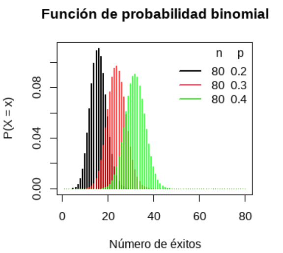

- **Distribución de Poisson:** Se utiliza para contar eventos discretos en un intervalo fijo de tiempo o espacio y es especialmente útil para modelar situaciones raras.

 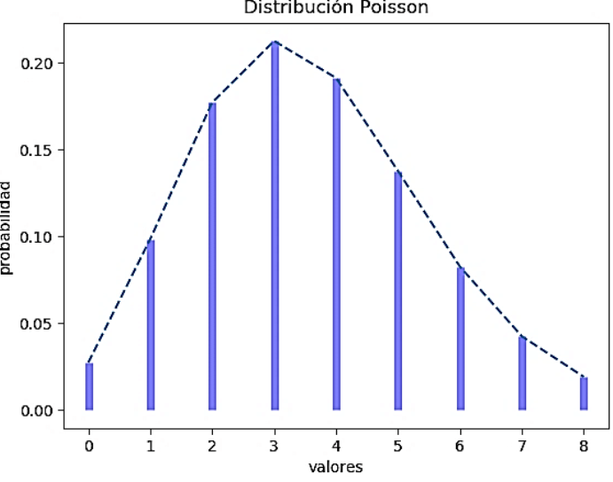

- **Distribución exponencial:** Modela tiempos entre eventos poisson.

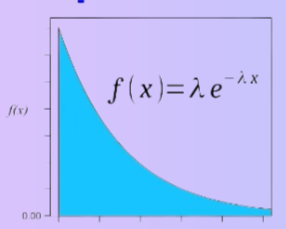

- **Distribución t-student:** Se utiliza principalmente para las pruebas de hipótesis. Nace de las operaciones matemáticas para construir un estadístico de prueba de 1 cola.

- **Distribución F:** Se utiliza principalmente para pruebas de hipótesis. Nace de las operaciones matemáticas para construir un estadístico de prueba de 2 colas.

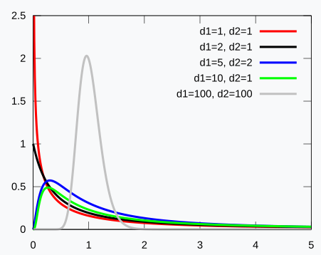

### Ejemplo de muestreo probabilístico
En este notebook haremos muestreos probabilísticos sobre estas funciones:
[Notebook de ejemplo de muestreo](Notebooks/muestreo.ipynb)

#### Reto
Investiga la función para hacer el muestreo de una función exponencial y  genera tanto la gráfica teórica como un histograma muestral.

## 2. Estimadores estadísticos

La probabilidad es el área de las matemáticas que dado un comportamiento modelado (una función de probabilidad asociada a un evento) y una correcta parametrización de dicha función, se obtienen valores probabilísticos (entre 0 y 1) de que el evento que se está estudiando suceda.  
Por otro lado, la estadística busca una forma científica de hacer estimaciones sobre dichos parámetros asumiendo que el comportamiento del evento probabilístico sigue una función de distribución específica. Una vez teniendo la estimación de los parámetros para dicha distribución, se tiene un modelo que podemos replicar para calcular probabilidades de eventos.

### Ejemplo:
En este notebook hacemos un ejemplo de cálculo de un estimador para la edad de una población: [Ejemplo de estimaciones](Notebooks/estimadores.ipynb)

### ¿Qué es el sesgo?
El sesgo en estadística se refiere a la tendencia de un estimador a desviarse del valor real del parámetro que intenta estimar. Un estimador se considera **insesgado** si su valor esperado coincide con el parámetro verdadero. Por el contrario, un estimador sesgado puede resultar en estimaciones sistemáticamente más altas o más bajas.

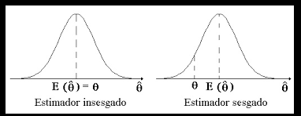

#### Recordatorio: cálculo de valor esperado

Intuitivamente, se puede pensar en el valor esperado como un promedio ponderado de los valores de una variable aleatoria.  

En el caso de que la variable aleatoria sea discreta, la fórmula para el valor esperado de una variable aleatoria $X$ es:  
$E[X]=\sum_{x=-\infty}^{\infty}xP(X=x)$  
donde P(X) es la función de probabilidad de la variable aleatoria.  

Para el caso de una variable aleatoria continua, la fórmula para el valor esperado de una variable aleatoria $X$ es:  
$E[X]=\int_Rxf(x)dx$  
donde f(x) es la función de densidad de la variable aleatoria.

### Ejemplos de estimadores sesgados

- **Media Muestral (X̄):** Aunque es un estimador comúnmente utilizado para la media poblacional, puede tener sesgo en distribuciones altamente asimétricas. 
- **Proporción Muestral (p̂):** Cuando la muestra es pequeña, puede resultar en estimaciones sesgadas de eventos raros (p.ej., si ejemplos de éxito son muy pocos).

Un caso específico de sesgo es el **sesgo de selección**, que ocurre cuando la muestra no es representativa de la población general.

## 3. Teorema Central del Límite

### ¿Qué es?
El Teorema Central del Límite (TCL) es uno de los pilares fundamentales de la estadística. Este teorema establece que, al tomar muestras aleatorias de una población cualquiera, la distribución de la media muestral tenderá a ser normal a medida que el tamaño de la muestra aumente, independientemente de la forma de la distribución poblacional original. Generalmente, se requiere que el tamaño de la muestra sea al menos 30 para que este teorema se aplique de manera efectiva.

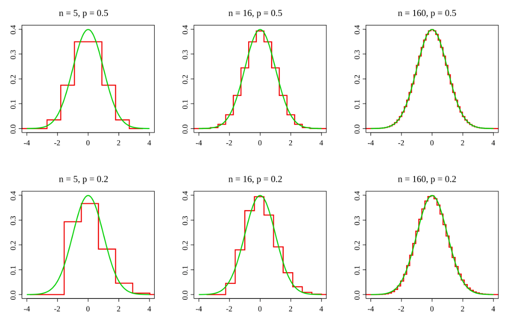

### ¿Cómo se puede usar?
El TCL permite utilizar la normalidad en muchos contextos estadísticos. Por ejemplo:
- Permite la aplicación de pruebas de hipótesis a distribuciones de medios de muestras.
- Facilita el cálculo de intervalos de confianza para la media poblacional.
- Ayuda a justificar el uso de modelos de regresión lineal.

### Ejemplo

En este notebook haremos un ejemplo con simulaciones para el teorema central del límite: [Ejemplo con teorema central del límite](Notebooks/tcl.ipynb)

### Reto

Genera un ejercicio parecido al anterior pero ahora haciendo simulaciones sobre una distribución exponencial con el parámetro que quieras. Juega con la cantidad de muestras y tamaño de muestras. Grafica la media del parámetro y compáralo contra la distribución normal teórica.

## 4. Pruebas de hipótesis

### Estadísticos de prueba

Los estadísticos de prueba son calculados a partir de los datos de la muestra y son utilizados para determinar si existe suficiente evidencia para rechazar la hipótesis nula $H_0$. Ejemplos de estadísticos incluyen la estadística Z y la estadística t, utilizadas dependiendo del tamaño de la muestra y la variabilidad de los datos.

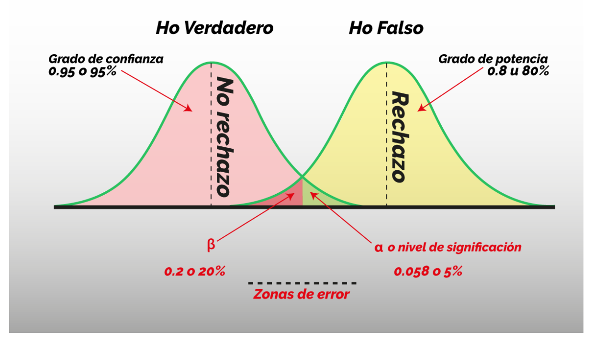

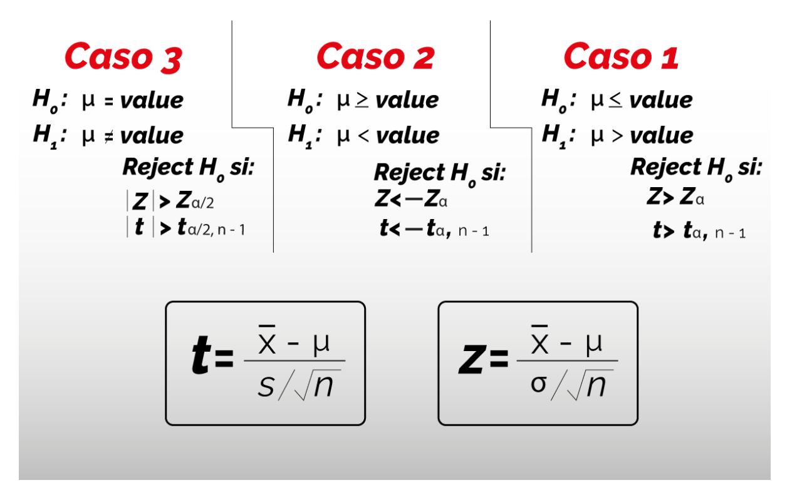

### p-value
El p-value es la probabilidad de observar un resultado tan extremo como el que se ha obtenido, bajo la suposición de que la hipótesis nula es verdadera. Un p-value bajo (comúnmente menor a 0.05) indica evidencia suficiente para rechazar la hipótesis nula en favor de la hipótesis alternativa $H_a$. Es importante recordar que un p-value no indica la probabilidad de que $H_0$ sea verdadero. Una interpretación más atinada puede ser la probabilidad de cometer un error al asumir que $H_a$ es el modelo correcto de donde se generaron los datos.

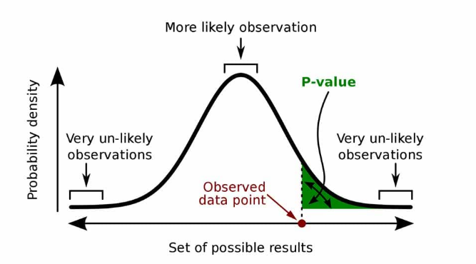

### Tipos de pruebas

#### Pruebas de 1 cola
Las pruebas de 1 cola son diseñadas para evaluar si un parámetro es mayor o menor que un valor específico. Se utiliza cuando se tiene una hipótesis clara sobre la dirección de la diferencia.

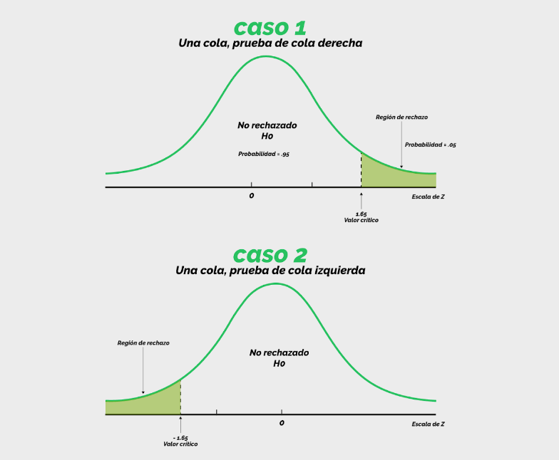

#### Pruebas de 2 colas
Las pruebas de 2 colas se utilizan cuando no se tiene una suposición específica sobre la dirección de la diferencia. Se prueba si el parámetro es significativamente diferente de un valor específico, ya sea mayor o menor.

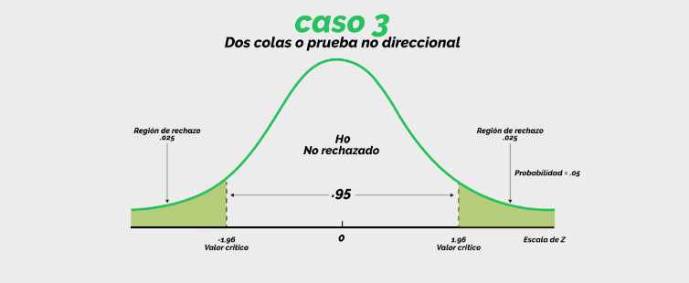

#### Pruebas de comparación de media entre 2 poblaciones
Se utilizan para determinar si hay una diferencia estadísticamente significativa entre las medias de dos poblaciones. Esto se puede realizar a través de pruebas t de Student para muestras independientes y relacionadas. La prueba t de Student para muestras independientes evalúa si los promedios de dos grupos son significativamente diferentes entre sí, mientras que la prueba para muestras dependientes (o pareadas) se usa cuando los datos de las dos muestras están emparejados de alguna manera (p.ej., mediciones antes y después en el mismo grupo).

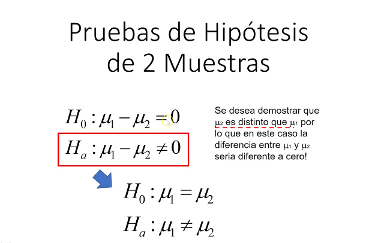

### Ejemplo

En este notebook veremos las aplicaciones de estos 3 tipos de pruebas: [Ejemplo de pruebas de hipótesis](Notebooks/hipotesis.ipynb)

### Reto

Haz una prueba de hipótesis de 2 colas comparando el valor de la media del ancho del pétalo contra algún valor que quieras usar. Interpreta el p-value y decide si rechazas o no echazas la hipótesis nula.  

Eso es todo para la sesión 2!
