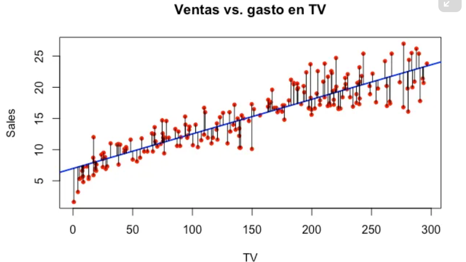
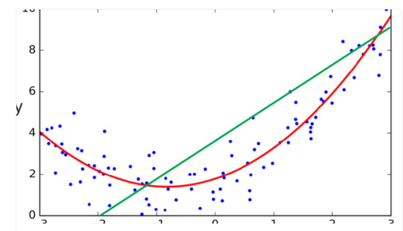
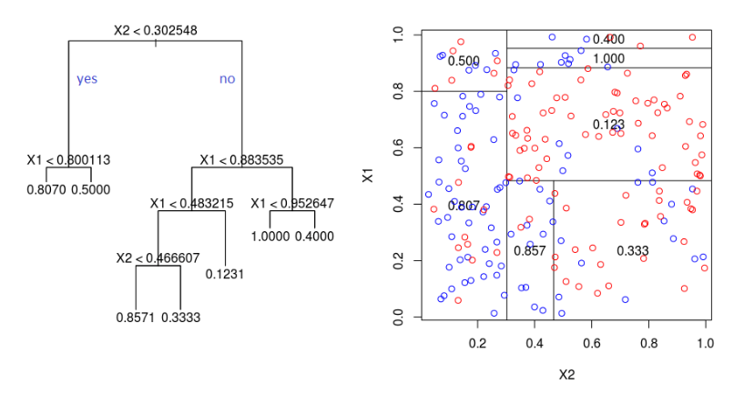
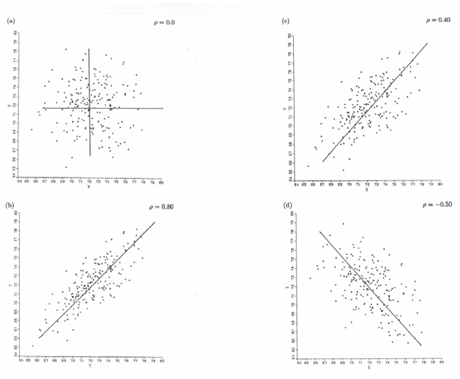
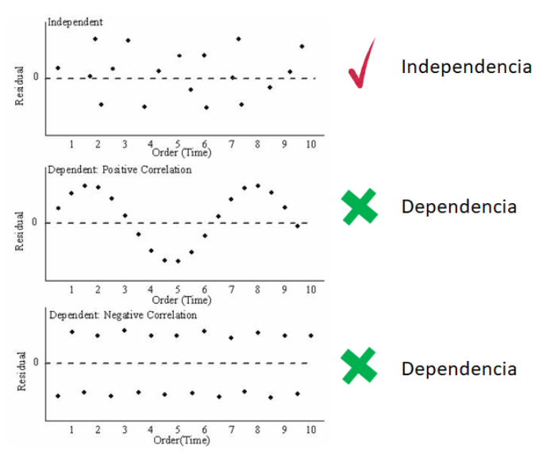
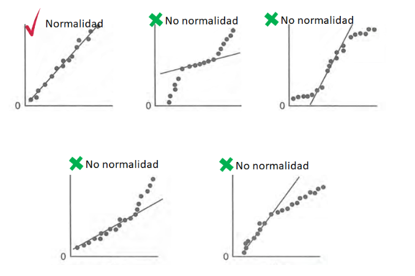
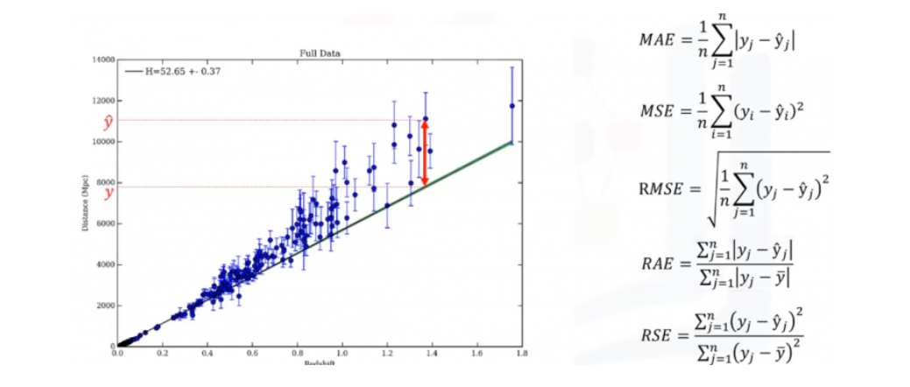
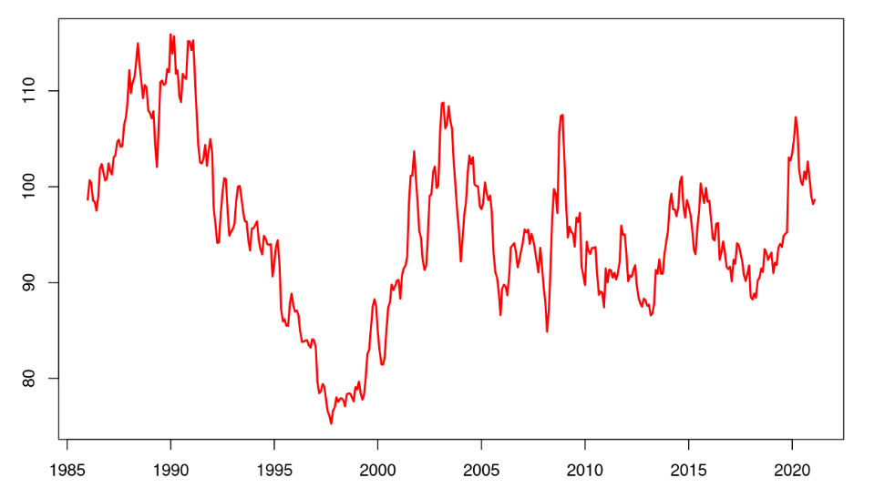
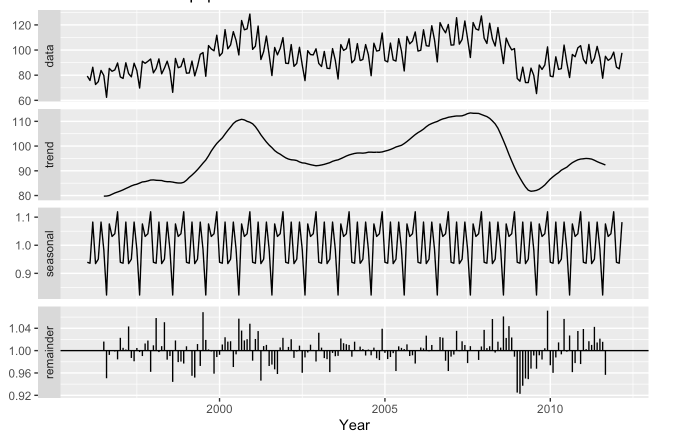
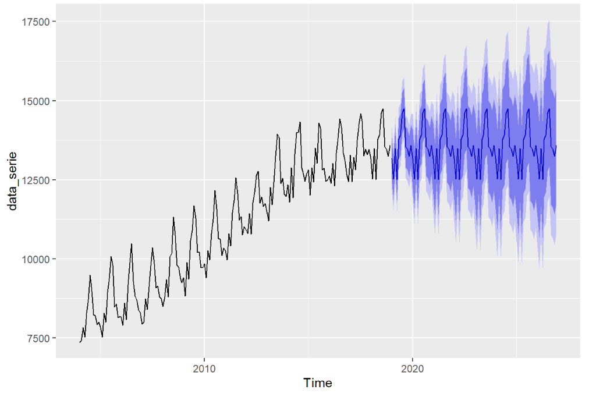

# Guía sobre Regresión Lineal y Series de Tiempo

## 1. Regresión Lineal

### ¿Para qué sirve?
La regresión lineal es una técnica fundamental en el análisis estadístico y se utiliza para predecir el valor de una variable dependiente (también llamada variable de respuesta o Y) basada en el valor de una o más variables independientes (o predictoras, llamadas X). Este método es bastante popular debido a su simplicidad y a la facilidad de interpretación de sus resultados. 

* **Aplicaciones Comunes**:
  - **Economía y Finanzas**: Predicción de precios de acciones, análisis de tendencias económicas.
  - **Ciencias Sociales**: Evaluación de la relación entre la educación y los ingresos.
  - **Salud Pública**: Análisis de datos de salud para predecir la propagación de enfermedades.

La forma matemática de la regresión lineal simple se puede representar como:
$$ Y = \beta_0 + \beta_1 X + \epsilon $$
donde:
- $Y$ es la variable dependiente.
- $\beta_0$ es la intersección o término constante.
- $\beta_1$ es la pendiente de la línea de regresión.
- $X$ es la variable independiente.
- $\epsilon$ es el término de error.

### Mismo problema, otros enfoques
Los problemas que se abordan con regresión lineal también pueden ser tratados con otros métodos estadísticos y de machine learning. Sin embargo, un aspecto fundamental del análisis de regresión lineal simple es cómo se obtienen los estimadores de los parámetros. 

#### Método de Mínimos Cuadrados para Regresión Lineal Simple
El método de **mínimos cuadrados** es una técnica que busca estimar los parámetros de la regresión lineal minimizando la suma de los cuadrados de las diferencias (errores) entre los valores observados y los valores pronosticados. Esta es la forma común de estimar los coeficientes de la regresión linear.

**Modelo de Regresión Lineal Simple**:
$$ Y = \beta_0 + \beta_1 X + \epsilon $$

**Paso 1: Definición de la función de pérdida**
La función de pérdida se define como la suma de los errores al cuadrado:
$$ S(\beta_0, \beta_1) = \sum_{i=1}^{n} (y_i - (\beta_0 + \beta_1 x_i))^2 $$
donde $y_i$ son los valores observados, $x_i$ son los valores independientes, y $n$ es el número total de observaciones.

**Paso 2: Minimizar la función de pérdida**
Para encontrar los valores óptimos de $\beta_0$ y $\beta_1$, se derivan las ecuaciones de la función de pérdida con respecto a los parámetros y se igualan a cero. Esto nos da un sistema de ecuaciones:

1. Derivada con respecto a $\beta_0$:
   $$ \frac{\partial S}{\partial \beta_0} = -2 \sum_{i=1}^{n} (y_i - (\beta_0 + \beta_1 x_i)) = 0 $$
   
2. Derivada con respecto a $\beta_1$:
   $$ \frac{\partial S}{\partial \beta_1} = -2 \sum_{i=1}^{n} (y_i - (\beta_0 + \beta_1 x_i)) x_i = 0 $$

Resolviendo este sistema de ecuaciones, encontramos las estimaciones para $\beta_0$ y $\beta_1$:

- **Estimador de $\beta_1$**:
$$ \hat{\beta_1} = \frac{n \sum_{i=1}^{n} (x_i y_i) - \sum_{i=1}^{n} x_i \sum_{i=1}^{n} y_i}{n \sum_{i=1}^{n} (x_i^2) - (\sum_{i=1}^{n} x_i)^2} $$

- **Estimador de $\beta_0$**:
$$ \hat{\beta_0} = \bar{y} - \hat{\beta_1} \bar{x} $$
donde $\bar{y}$ y $\bar{x}$ son las medias de las variables $y$ y $x$, respectivamente.

Estos estimadores son importantes porque proporcionan una línea de mejor ajuste que minimiza la suma de los cuadrados de las diferencias (residuos), permitiendo así realizar inferencias y pronósticos con base en el modelo construido.

#### Otros Enfoques
Además de la regresión lineal simple, los problemas que pueden ser abordados con regresión también pueden ser tratados con:

- **Regresión Polinómica**: Extiende el concepto de regresión lineal simple al permitir relaciones no lineales, como se describió anteriormente.

- **Árboles de Decisión**: Utilizan un enfoque más flexible para segmentar el espacio y modelar variaciones complejas.

- **Máquinas de Soporte Vectorial (SVM)**: Estas máquinas son particularmente útiles en contextos de alta dimensión, ya que pueden modelar relaciones complejas sin necesidad de especificar explícitamente la forma de la relación.

- **Redes Neuronales**: Estas estructuras son capaces de aprender patrones no lineales en grandes conjuntos de datos, permitiendo capturar relaciones complejas y profundas entre las variables.

### Supuestos de regresión lineal
Los supuestos son cruciales para la validez de los resultados de la regresión lineal. Si estos supuestos no se cumplen, los coeficientes estimados podrían ser sesgados o no confiables:

1. **Linealidad**: La relación entre las variables debe ser lineal. Se puede verificar usando gráficos de dispersión.

2. **Independencia**: Las observaciones deben ser independientes. Esto es particularmente importante en series de tiempo, donde pueden existir correlaciones.

3. **Homoscedasticidad**: La variabilidad de los errores debe ser constante. Se puede comprobar realizando gráficos de residuos.

4. **Normalidad**: Los residuos (diferencias entre los valores observados y los pronosticados) deben seguir una distribución normal, lo que ayuda en la inferencia estadística.

### Métricas de evaluación
Las métricas son esenciales para evaluar el desempeño de un modelo de regresión y entender su precisión en la predicción:

- **Error Cuadrático Medio (MSE)**: Evalúa la media de los cuadrados de los errores, penalizando errores grandes. Se expresa como:
  $$ MSE = \frac{1}{n} \sum_{i=1}^{n} (y_i - \hat{y}_i)^2 $$

- **Raíz del Error Cuadrático Medio (RMSE)**: La raíz cuadrada del MSE proporciona una medida de error en las mismas unidades que la variable dependiente:
  $$ RMSE = \sqrt{MSE} $$

- **Coeficiente de Determinación ($R^2$)**: Mide la proporción de varianza explicada por el modelo. Se calcula como:
  $$ R^2 = 1 - \frac{SS_{res}}{SS_{tot}} $$
  donde $SS_{res}$ es la suma de los cuadrados de los residuos y $SS_{tot}$ es la suma total de los cuadrados.

### Ejemplo

En el siguiente notebook realizamos un ejemplo de una regresión lineal simple y luego una regresión lineal múltiple para obtener un modelo de relación.
El ejemplo se realiza con un dataset de california housing que tiene información sobre el precio medio de las casas en cuadras en California en USD.  
Buscamos un modelo de regresión que pueda explicar el precio en este notebook: [Notebook de ejemplo de regresión](Notebooks/regresion_lineal.ipynb)

### Reto
Utilizando el dataset de [diabetes](https://scikit-learn.org/stable/modules/generated/sklearn.datasets.load_diabetes.html#sklearn.datasets.load_diabetes), genera un modelo de regresión lineal múltiple y realiza un análisis ANOVA para determinar la relevancia de los regresores.

---

## 2. Series de Tiempo

### Características de una serie de tiempo
Las series de tiempo son secuencias de datos recopilados a intervalos regulares. Su análisis ayuda a identificar patrones significativos a lo largo del tiempo. Algunas características clave incluyen:

- **Tendencias**: Representan cambios a largo plazo en la serie, ejemplos serían el aumento del nivel del mar o el crecimiento poblacional.

- **Estacionalidad**: Reflejan patrones que se repiten en intervalos regulares, como incrementos en el consumo de helados en verano.

- **Ciclos**: Fluctuaciones que no son estacionales y ocurren a largo plazo. Por ejemplo, recesiones en el ciclo económico.

- **Ruido**: Comportamiento aleatorio en los datos que no se puede predecir.

### Descomposición de series de tiempo
La descomposición permite analizar series de tiempo separando sus componentes fundamentales. El proceso generalmente involucra:

1. **Identificación de la tendencia**: Determinar la dirección general en que se mueve la serie a lo largo del tiempo.
  
2. **Cálculo de la estacionalidad**: Identificar y calcular las variaciones estacionales.

3. **Análisis del ruido**: Estudiar los componentes subyacentes que no se pueden atribuir ni a tendencia ni a estacionalidad.

Esta técnica es útil para simplificar el análisis y para realizar pronósticos más precisos.

La descomposición en estos factores puede ser en 2 tipos de modelos, aditivo o multiplicativo:

#### Modelo aditivo
$Y_i=T_i+E_i+\epsilon_i$

#### Modelo multiplicativo
$Y_i=T_i*E_i*\epsilon_i$

#### Ejemplo de descomposición
En este notebook trabajamos con una serie de tiempo y generamos la descomposición de la serie de tiempo así como las gráficas: [Ejemplo de descommposición de series de tiempo](Notebooks/descomposicion.ipynb)

### Modelos
Los modelos para el análisis de series de tiempo son variados, y cada uno tiene su uso específico:

- **Modelos Autorregresivos (AR)**: Utilizan la relación entre una observación y varias observaciones anteriores.
El modelo es:  
$X_t=c+\sum_{i=1}^p\phi_iX_{t-i}+\epsilon_t$  
[Notebook con ejemplo de modelo autoregresivo](Notebooks/ar.ipynb)

- **Modelos de Promedio Móvil (MA)**: Se centran en la relación entre una observación actual y los errores de modelo de observaciones pasadas.  
[Notebook con ejemplo de modelo de media móvil](Notebooks/ma.ipynb)

- **Modelos ARIMA**: Incluyen componentes autorregresivos y de promedio móvil, útiles para series que presentan tendencia o estacionalidad.

- **Modelos SARIMA**: Extensión de ARIMA que incluye factores estacionales, capturando mejor las fluctuaciones estacionales en la serie.

[Notebook de ejemplo de modelos arima y sarima](Notebooks/arima.ipynb)

### Pronósticos
Los pronósticos se generan a partir de los modelos y permiten anticipar valores futuros. Utilizan la información histórica para hacer inferencias sobre el futuro:

$$ \hat{y}_{t+h} = f(y_{t}, y_{t-1}, \ldots, y_{t-p}) $$

donde $h$ es el punto en el tiempo en el que deseamos predecir.
  
Una buena práctica es evaluar la precisión de los pronósticos usando métricas como MSE o RMSE.

### Intervalos de confianza
Los intervalos de confianza son utilizados para expresar la incertidumbre en las predicciones de series de tiempo. Proporcionan un rango de valores dentro del cual se espera que caiga el valor pronosticado:

$$ \hat{y} \pm Z \cdot \sigma $$

donde $\hat{y}$ es el valor pronosticado, $Z$ es el valor crítico correspondiente a un nivel de confianza específico (por ejemplo, 1.96 para un 95% de confianza), y $\sigma$ es la desviación estándar de las predicciones. Esto es fundamental en la toma de decisiones basadas en pronósticos.

#### 
